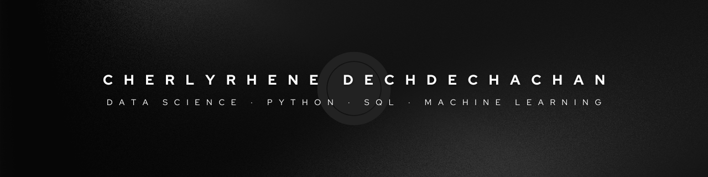

<!-- Centered banner with tighter spacing -->

  

<h2 align="center">
  👋 Hi, I'm <b>Cherlyrhene Dechdechachan</b>
</h2>

  Aspiring <b>Data Scientist</b> | MScAC (U of T) Candidate  
   Python · SQL · Machine Learning · Data Visualization  
   📫 <a href="mailto:cherlyrhened@gmail.com">cherlyrhened@gmail.com</a> |
  <a href="https://github.com/cherlyrhene/hello-world-python">My First Repo</a>

---

### 🧠 What I'm Working On

  

# Hi there 👋, I'm Cherlyrhene Dechdechachan

🎓 Aspiring **Data Scientist** | Building my portfolio for **MScAC (Data Science)** at the University of Toronto  
💼 Technical Support Specialist @ Accenture  
🌱 Currently learning **Python · SQL · Machine Learning · Data Visualization**  
📂 Check out my first repo: [hello-world-python](https://github.com/cherlyrhene/hello-world-python)  
📫 Reach me at: **cherlyrhened@gmail.com**  

---

### 🧠 What I’m working on
- Building a full GitHub + Kaggle data-science portfolio  
- Exploring pandas, matplotlib, and scikit-learn  
- Publishing beginner-friendly Jupyter notebooks  

---

### ⚙️ Tools & Languages
Python | SQL | Git | Jupyter Notebook | VS Code | Anaconda  

---

⭐ *"Every expert was once a beginner who didn’t quit."*
